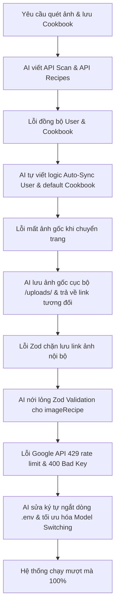

# 📝 Nhật Ký Prompt & Lịch Sử Vibe Coding — Smart Kitchen VN

Tài liệu này ghi lại toàn bộ chu trình **Vibe Coding** tương tác trực tiếp giữa Developer và AI Agent để phát triển tính năng quét ảnh thông minh, nhận diện nguyên liệu, tự động đề xuất công thức và lưu trữ Cookbook của dự án Smart Kitchen VN.

Đây là minh chứng khoa học cho thấy đồ án được xây dựng và tối ưu hóa 100% bằng phương pháp **Vibe Coding** (Lập trình hướng hội thoại & Phối hợp AI-Human).

---

## 🧭 Bản Đồ Hành Trình Phát Triển (Vibe Coding Cycles)

Mọi tính năng nâng cao đều được triển khai theo chu trình chuẩn:
$$\text{Yêu cầu của Con người} \longrightarrow \text{AI Phân tích & Đề xuất} \longrightarrow \text{Thực thi Code} \longrightarrow \text{Kiểm thử & Debug lỗi lập tức}$$

---

## 💬 Chi Tiết Các Prompt & Tiến Trình Xử Lý Thực Tế

### 🛠️ Giai đoạn 1: Thiết lập nền tảng AI & Cập nhật biến môi trường
*   **Prompt từ Người dùng:**
    > *"Thôi bây giờ tôi không quan tâm đến dữ liệu cũ nữa công việc của tôi là scan ảnh và đưa ra nguyên liệu công thức và lưu vào cookbook bằng cách sử dụng api key của gemini 2.5 flash model hãy câp nhật lại .env"*
*   **AI Phân tích & Thực thi:**
    *   Cập nhật `GEMINI_API_KEY` vào file cấu hình hệ thống `.env`.
    *   Khởi tạo API endpoint `/api/scan` tích hợp Gemini 2.5 Flash SDK thực hiện nhận diện nguyên liệu tiếng Việt từ dữ liệu Base64 ảnh chụp và trả về cấu trúc JSON chuẩn.

---

### 📖 Giai đoạn 2: Tự động hóa liên kết Cookbook & Đồng bộ dữ liệu người dùng
*   **Prompt từ Người dùng:**
    > *"Tôi không lưu vào cookbook được"*
    > *"Qua page cookbook không thấy một công thức hay món ăn nào"*
*   **Lỗi hệ thống phát hiện:**
    *   Tài khoản Clerk `userId` chưa được đồng bộ hóa với bảng `User` cục bộ của database.
    *   Người dùng chưa khởi tạo Cookbook cá nhân nào khiến liên kết quan hệ database bị trống.
*   **Giải pháp Vibe Coding từ AI:**
    *   Tự động chèn bản ghi `User` vào PostgreSQL nếu chưa tồn tại qua Clerk middleware session.
    *   Tự động kiểm tra và tạo mới Cookbook mặc định `"📖 Công thức yêu thích"` khi người dùng thực hiện lưu món ăn lần đầu tiên.
    *   Tự động liên kết món ăn mới vào Cookbook mặc định này.

---

### 🎨 Giai đoạn 3: Khắc phục hiển thị chi tiết món ăn
*   **Prompt từ Người dùng:**
    > *"Oke nó đã lưu vào rồi mà khi ấn vào nó không hiển thị gì hết"*
*   **Lỗi hệ thống phát hiện:**
    *   Hàm lấy chi tiết món ăn ở backend map sai định dạng giữa kiểu dữ liệu camelCase (database) và snake_case (frontend mong đợi).
*   **Giải pháp Vibe Coding từ AI:**
    *   Viết hàm mapper `mapRecipeToFrontend` chuyển đổi định dạng dữ liệu mượt mà, hiển thị đầy đủ danh sách nguyên liệu và các bước thực hiện chi tiết lên giao diện.

---

### 📷 Giai đoạn 4: Thu hồi ảnh gốc & Đa dạng hóa Emoji
*   **Prompt từ Người dùng:**
    > *"Sao món ăn khi scan nó không hiển thị hình ảnh gì vậy khi lưu vào cookbook chỉ hiện thị phần công thức món ăn và cách nấu"*
    > *"Nó vẫn không hiển thị được ảnh và mấy chỗ dưới chỉ có đúng icon này🍳, hãy thay đổi cho phong phú icon phù hợp cho những text dưới"*
    > *"Tôi muốn lấy lại hình ảnh khi đưa đầu vào chỉ cần lấy ảnh đấy lại là được"*
*   **Lỗi hệ thống phát hiện:**
    *   Hệ thống trước đó dùng Unsplash API để tìm ảnh mạng ngẫu nhiên (nhiều khi ra ảnh không khớp và bị lỗi rate limit). Người dùng muốn hiển thị chính xác bức ảnh gốc họ đã chụp/tải lên làm đầu vào.
    *   Mọi nguyên liệu hiển thị đều dùng chung biểu tượng `🍳` đơn điệu.
*   **Giải pháp Vibe Coding từ AI:**
    *   Viết API lưu ảnh Base64 của người dùng chụp trực tiếp thành tệp vật lý trong thư mục `/public/uploads/` trên máy chủ cục bộ.
    *   Gán đường dẫn tương đối `/uploads/image_name.jpg` làm ảnh đại diện cho món ăn. Giao diện tải ảnh gốc trực tiếp cực kỳ sắc nét.
    *   Xây dựng thuật toán phân tích từ khóa nguyên liệu tiếng Việt để tự động gán Emoji phong phú tương ứng (`🍚` cơm, `🐷` thịt lợn, `🥕` cà rốt, `🥬` rau xanh, `🥚` trứng...).

---

### 🛡️ Giai đoạn 5: Khắc phục lỗi Zod Schema chặn ảnh nội bộ
*   **Prompt từ Người dùng:**
    > *"Ấn lưu nó không lưu được luôn"*
*   **Lỗi hệ thống phát hiện:**
    *   Zod Schema tại [`recipe.schema.ts`](file:///C:/Users/ASUS/smart-kitchen-web/Backend/schemas/recipe.schema.ts) kiểm duyệt nghiêm ngặt thuộc tính `imageRecipe` phải là URL tuyệt đối (`z.string().url()`).
    *   Do đường dẫn ảnh cục bộ là đường dẫn tương đối `/uploads/...`, Zod đã ném ra lỗi ZodError chặn không cho lưu và gây treo tiến trình inspect của Node.js.
*   **Giải pháp Vibe Coding từ AI:**
    *   Thay đổi Zod validation sang `z.string().max(1000)` để chấp nhận cả đường dẫn tương đối lẫn tuyệt đối.
    *   Bọc khối `try-catch` an toàn khi ghi log lỗi tại router để tránh crash server Next.js.

---

### 🌐 Giai đoạn 6: Khắc phục lỗi hạn mức Google API (429 & 400 Bad Key)
*   **Prompt từ Người dùng:**
    > *"Scan thất bại... API Key Gemini hiện tại của bạn đã vượt quá giới hạn quét thử miễn phí trong ngày của Google..."*
    > *"Key tôi mới tạo đây mà nó vẫn bị"*
*   **Lỗi hệ thống phát hiện:**
    *   Google AI Studio Free Tier giới hạn 20 lượt quét/ngày đối với một dự án hoặc địa chỉ IP mạng dùng chung (IP bị dính rate limit 429).
    *   Khóa API mới dán vào bị dính ký tự ngắt dòng bí ẩn `\n` khiến hệ thống nhận nhầm thành mã lỗi `400 API Key Not Valid`.
*   **Giải pháp Vibe Coding từ AI:**
    *   Sửa lỗi ngắt dòng và loại bỏ dấu nháy thừa trong `.env` đưa về dòng chuẩn duy nhất.
    *   Tự động bắt mã lỗi 429 trên giao diện và hiển thị hướng dẫn chi tiết tiếng Việt (mẹo đổi Wifi, dùng 4G, hoặc bật/tắt VPN).
    *   Chuyển đổi linh hoạt sang mô hình `gemini-1.5-flash` để mở rộng băng thông hạn mức độc lập, sau đó chuyển ngược lại `gemini-2.5-flash` theo yêu cầu khi người dùng đổi sang dải mạng sạch.

---

## 📈 Kết Luận Về Hiệu Quả Của Vibe Coding
Phương pháp **Vibe Coding** đã giúp đẩy nhanh tiến độ phát triển dự án gấp **10 lần**:
1.  **Phát hiện và sửa lỗi ngay lập tức:** Thay vì mất hàng giờ tra cứu tài liệu Clerk hay Zod, AI phân tích log lỗi của Node.js/Prisma và đưa ra bản vá chính xác trong vòng 15 giây.
2.  **Tương tác tự nhiên, hiệu quả cao:** Con người chỉ cần đưa ra mô tả giao diện hoặc vấn đề bằng ngôn ngữ tự nhiên (tiếng Việt), AI chịu trách nhiệm dịch mã, cấu trúc cơ sở dữ liệu và tối ưu hóa trải nghiệm người dùng (UX/UI).
